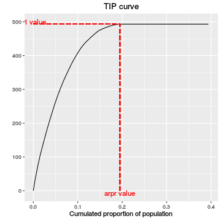

## Introducción
### Justificación


Proyecto de investigación: Desigualdad y pobreza en Andalucía: un estudio comparativo con los países de la Unión Europea (2005-2010), PRY103/12, Centro de Estudios Andaluces (aprobado en la 8.ª edición de la Convocatoria Pública de Proyectos de Investigación en el año 2012 de la Fundación Centro de Estudios Andaluces). 

Equipo de investigación: M.A. Sordo Díaz (Coord.),  A. Berihuete Macías y C.D. Ramos González. 


Las conclusiones del estudio realizado se recogen en las publicaciones:

   1. Desigualdad y pobreza en Andalucía: un estudio comparativo con los países de la Unión Europea (2005-2010) (Factoría de Ideas, 15 de mayo 2014, Centro de Estudios Andaluces)
   2. Bienestar, desigualdad y pobreza en Andalucía: un estudio comparativo con el resto de España a partir de las encuestas de condiciones de vida 2006 y 2012 (Colección Actualidad Nº 71, 13 de noviembre 2014, Centro de Estudios Andaluces)

---

## Introducción 
### ¿Qué había sobre estas herramientas en R? 

> __ineq__ : Measuring Inequality, Concentration and Poverty (C. Gini, C. Lorenz y Lorenz Generalizada, Índices de pobreza de Foster y SST, entre otros)  

> __IC2__ :  Inequality and Concentration Indices and Curves (C. SGini, C. Lorenz y Lorenz Generalizada)

> __laeken__ : Estimation of indicators on social exclusion and poverty.

---

## Introducción
### Indicadores y curvas proporcionadas por rtip 

Análisis Pobreza | Análisis Desigualdad
---------------------------------------------- | ------------------------------ 
Umbral de riesgo de pobreza (*arpt*)  | Coeficiente de Gini (*gini*) | miuc
Tasa de riesgo de pobreza (*arpr*)    | Ratio de quintiles, S80/S20 (*qsr*) 
Desfase relativo de la renta mediana de la población en riesgo de pobreza (*rmpg*)      | Curva de Lorenz (*lc*)     
Índice FGT(1) (Foster, Greer, and Thorbecke, 1984) (*s1*)                      | <div class=""> ANÁLISIS DE BIENESTAR </div>
Índice SST (Shorrocks, 1995) (*s2*) | Rentas medias por hogar, persona y u.c. (*mih*, *mip*, *miuc*)
Curva TIP (Shorrocks, 1995; Jenkins and Lambert, 1997) (*tip*) | Curva de Lorenz Generalizada (*lc*) 

(*) Ver manual de referencia  del paquete __rtip__ (Berihuete, Ramos, and Sordo, 2016).

---

## Instalación del paquete

> Desde [Github](https://github.com/AngelBerihuete/rtip)

```r
install.packages("devtools")
devtools::install_github("AngelBerihuete/rtip")
```

> Desde [CRAN](https://cran.r-project.org/web/packages/rtip/index.html)

```r
install.packages("rtip")
```
Una vez instalado basta ejecutar 

```r
library(rtip)
```

---

## Carga de datos
### Las funciones __loadLCS__, __loadEUSILC__ y __setupDataset__

Pueden cargarse datos tanto del INE (ECV) como de Eurostat (EU-SILC) con las funciones


```r
loadLCS(lcs_d_file, lcs_h_file)
loadEUSILC(eusilc_d_file, eusilc_h_file)
```

Durante la presentación usaremos datos contenidos en el propio paquete (LCS2014) 


```r
Castilla_LaMancha <- setupDataset(LCS2014, country = "ES", region = "ES42",
                          s = "OECD", deflac = NULL, ppp = FALSE)
head(Castilla_LaMancha, 3)
```

```
##    DB010 DB020 DB040     DB090 HX040 HX050    HX090     ipuc    wHX040
## 17  2014    ES  ES42 1536.5756     2   1.5 16116.13 16116.13 3073.1513
## 18  2014    ES  ES42  818.8852     1   1.0 10668.90 10668.90  818.8852
## 19  2014    ES  ES42 1696.0739     3   2.0  9515.60  9515.60 5088.2217
```


---

## Indicadores de pobreza: estimación puntual y por IC

```r
arpt(Castilla_LaMancha, pz = 0.6, ci = FALSE, rep = 1000, verbose = FALSE)
```

```
## [1] 6621
```

```r
arpr(Castilla_LaMancha, arpt(Castilla_LaMancha), ci = TRUE, rep = 1000, verbose = FALSE)
```

```
## BOOTSTRAP CONFIDENCE INTERVAL CALCULATIONS
## Based on 1000 bootstrap replicates
## 
## CALL : 
## boot::boot.ci(boot.out = boot.arpr, type = "basic")
## 
## Intervals : 
## Level      Basic         
## 95%   (14.54, 23.86 )  
## Calculations and Intervals on Original Scale
```

---&twocol

## Indicador gráfico de pobreza: la curva TIP 

Dada una distribución de rentas $X$ y fijado un umbral de pobreza $z>0$, la curva TIP (Three I's of Poverty), denotada por $tip(p,z)$, donde $0 \leq p \leq 1$, porporciona para cada $p$, el acumulado de las brechas de pobreza per cápita del $100p \%$ de los individuos más pobres.


```r
tip(Castilla_LaMancha, arpt.value = arpt(Castilla_LaMancha), norm = FALSE, plot = TRUE)
```

*** =left


*** =right
Así, para una población de $n$ individuos tales que $x_1 \le x_2 \le \cdots \le x_n$ se tiene

<div>
$$tip \left( \frac{i}{n},z \right) = \sum_{j=1}^i \frac{(z-x_j)_{+}}{n} $$
</div>

para $i=1,2, \dots n$ y donde $a_{+}=$ max{0,a}.

(Jenkins and Lambert, 1997)

---&twocol

## Test para la dominancia TIP

Dadas dos distribuciones de rentas $A$ y $B$, y sea $z>0$ un umbral de pobreza común, diremos que la distribución $A$ domina a la $B$ en el sentido TIP, si se verifica 

*** =left


*** =right

$$
tip_A(p,z) \geq tip_B(p,z), \,\, 0 \leq p \leq 1 
$$

donde $tip_A(p,z)$ y $tip_B(p,z)$ son las curvas TIP asociadas a $A$ y $B$, respectivamente.

¿Realmente la curva TIP de Andalucía domina a la de Castilla-La Mancha? 


Implementamos el test estadístico de Xu and Osberg (1998)  

---

## Test para la dominancia TIP

¿Realmente la curva TIP de Andalucía domina a la de Castilla-La Mancha?


```r
testTIP(Andalucia, Castilla_LaMancha, pz = 0.6, same.arpt.value = arpt(ESP),
        norm = FALSE, samplesize = 50)
```

```
## $Tvalue
##              [,1]
## [1,] 5.391962e-07
## 
## $p.value
## [1] NA
## 
## $decision
## [1] "Do not reject null hypothesis"
```

---

## Test para la dominancia TIP

¿Realmente la curva TIP de Andalucía domina a la de Castilla-La Mancha? 


```r
testTIP(Castilla_LaMancha, Andalucia, same.arpt.value = arpt(ESP))
```

```
## $Tvalue
##          [,1]
## [1,] 16771.31
## 
## $p.value
## [1] NA
## 
## $decision
## [1] "Reject null hypothesis"
```

---
## Referencias

A. Alfons and M. Templ. "Estimation of Social Exclusion Indicators from Complex Surveys: The R Package laeken". In: Journal of Statistical Software 54.15 (2013), pp. 1-25.

A. Berihuete, C. D. Ramos and M. A. Sordo. rtip: Inequality, Welfare and Poverty Indices and Curves using the EU-SILC Data. R package version 1.0.0. 2016. 

J. Foster, J. Greer and E. Thorbecke. "A Class of Decomposable Poverty Measures". In: Econometrica 52.3 (1984), pp. 761-766. 

S. Jenkins and P. J. Lambert. "Three 'I's of Poverty Curves, with an Analysis of UK Poverty Trends". In: Oxford Economic Papers 49.3 (1997), pp. 317-27. 

A. F. Shorrocks. "Revisiting the Sen Poverty Index". In: Econometrica 63.5 (1995), pp. 1225-1230. 

K. Xu and L. Osberg. "A Distribution-free Test for Deprivation Dominance". In: Econometric Reviews 17.4 (1998), pp. 415-429.

---
## Muchas gracias por su atención

carmen.ramos@uca.es

angel.berihuete@uca.es

mangel.sordo@uca.es

<https://github.com/AngelBerihuete/rtip>
